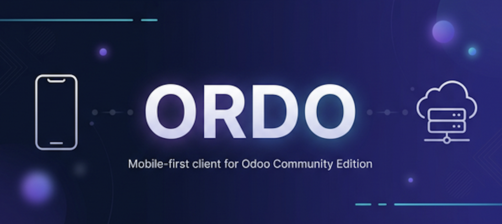

<p align="center">
  
</p>

<p align="center">
  <a href="https://opensource.org/licenses/AGPL-3.0"></a>
  
  
  
</p>

<p align="center">
  <strong>The Odoo Community mobile experience, reimagined.</strong>
</p>

<p align="center">
  Native iOS. Schema-driven UI. One clean API across Odoo 17, 18, and 19.
</p>

<p align="center">
  <a href="#highlights">Highlights</a> •
  <a href="#architecture">Architecture</a> •
  <a href="#quick-start">Quick start</a> •
  <a href="#roadmap">Roadmap</a>
</p>

---

## Highlights

- **Native iOS**, built for touch-first Odoo workflows
- **Schema-driven forms and lists**, powered by real Odoo metadata
- **One normalized backend contract** across Odoo 17, 18, and 19
- **Already shipped:** auth, browse, detail, edit, actions, chatter, offline-resilient cache

Ordo is production-minded, but still evolving. Full offline sync, richer attachments, and broader workflow polish are next.

## Architecture

```text
iOS App (SwiftUI)
    ↓ HTTPS / JWT
NestJS Middleware
    ↓ JSON-RPC
Odoo 17 / 18 / 19
```

### Stack

- **iOS:** SwiftUI, `@Observable`, async/await, Keychain, file cache
- **Backend:** NestJS 11, TypeScript 5, Redis, `class-validator`
- **Testing:** Jest, Supertest, Xcode / `xcodebuild`

## Quick start

### Requirements

- Node.js 22 LTS
- npm 10+
- Xcode 15+
- Docker *(optional, for local Odoo validation)*

### Install

```bash
git clone https://github.com/tuanle96/ordo.git
cd ordo/backend
npm install
cp .env.example .env
```

Set the required values in `.env`:

```env
JWT_ACCESS_SECRET=your-access-secret
JWT_REFRESH_SECRET=your-refresh-secret
JWT_ACCESS_EXPIRES_IN_SECONDS=900
JWT_REFRESH_EXPIRES_IN_SECONDS=604800
REDIS_URL=redis://127.0.0.1:6379
ODOO_REQUEST_TIMEOUT_MS=15000
ODOO_SESSION_TTL_SECONDS=1800
```

### Run

**Option A — Docker Compose (recommended):**

```bash
cd ..  # from repo root
docker compose up --build
```

This starts both the backend and Redis automatically.

**Option B — Local Node.js:**

```bash
# Start Redis first (or use an existing instance)
npm run start:dev
```

API base URL:

```text
http://localhost:38424/api/v1/mobile
```

Run the iOS app from `ios/Ordo.xcodeproj`, or build with:

```bash
xcodebuild -project ios/Ordo.xcodeproj \
  -scheme Ordo \
  -destination 'generic/platform=iOS Simulator' \
  build
```

Optional local Odoo stack:

```bash
cd odoo-instances
docker compose up -d --build
```

## Roadmap

Next major areas:

- wider iOS observation migration
- barcode + inventory workflows
- richer attachment/media flows
- deeper offline sync
- notifications, realtime, biometrics, multi-server support

For full details:

- [`docs/project-roadmap.md`](docs/project-roadmap.md)
- [`docs/project-changelog.md`](docs/project-changelog.md)
- [`docs/system-architecture.md`](docs/system-architecture.md)
- [`docs/add-odoo-community-module-support.md`](docs/add-odoo-community-module-support.md)

## Contributing

PRs are welcome. Keep changes focused, run relevant validation, and use [Conventional Commits](https://www.conventionalcommits.org/).
If you are onboarding support for a new Odoo app/module, start with [`docs/add-odoo-community-module-support.md`](docs/add-odoo-community-module-support.md).

## License

Licensed under **AGPL-3.0**. If you modify and deploy Ordo as a network service, you must release the corresponding source code under AGPL-3.0.

---

<p align="center">
  Built with ❤️ for the Odoo Community
</p>